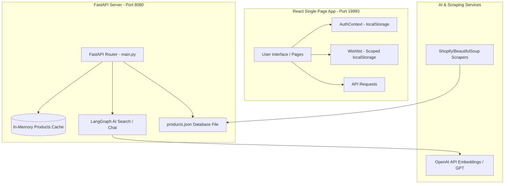

# 🎓 DesiFinds: Developer Handover & Onboarding Guide

Welcome to the team! **DesiFinds** is a premium, AI-powered shopping assistant that helps users discover high-quality Indian alternative brands to replace global labels. 

This guide is written specifically for you as a newcomer to help you understand the business context, the system architecture, how the code is organized, and how to run it.

---

## 🎯 1. What is DesiFinds? (The Core Concept)
Many consumers want to buy local, premium Indian goods (like clothing from *Snitch*, bags from *Mokobara*, or skincare from *Minimalist*) but don't know where to start when comparing them to global brands (like *Zara*, *Away*, or *The Ordinary*). 

**DesiFinds** solves this:
- **Search Directory**: Browse 3,150+ real, scraped products across 14 categories.
- **Side-by-Side Trust Analysis**: A dashboard comparing pricing, materials, and features of local brands vs. global brands.
- **AI Chatbot**: An interactive shopping advisor. If a user asks *"What is a good local alternative to CeraVe?"*, the AI deconstructs the query, retrieves matching products from our database, and provides recommendations.

---

## 🏗️ 2. The Big Picture (System Architecture)

DesiFinds uses a **decoupled client-server architecture**:



### Key Pillars:
1. **Frontend (React + TypeScript)**: Built using Vite. It communicates with the backend via API endpoints.
2. **Backend (FastAPI)**: Serves endpoints for products list, categories, trending products, and chat.
3. **Database (In-Memory JSON)**: Instead of a SQL database, the app reads and writes to `data/products.json`. During startup, the backend loads this entire list into memory for ultra-fast query matching.
4. **AI / RAG (Retrieval-Augmented Generation)**: Uses **LangGraph** to process search/chat queries. When a search is made, it performs semantic vector math (using OpenAI embeddings and ChromaDB) to fetch the most contextually relevant alternatives.

---

## 📁 3. Tour of the Codebase (Where things live)

Here are the key folders you should get familiar with:

### 🐍 Backend (`/backend`)
*   **[main.py](file:///c:/Users/Bhagya%20B/Downloads/Desi-Finds/backend/main.py)**: The front door of the backend. Defines all the HTTP endpoints (e.g. `/api/products`, `/api/chat`).
*   **`backend/scrapers/`**: Scripts that harvest raw products from Shopify brand feeds.
    *   **[master_pipeline.py](file:///c:/Users/Bhagya%20B/Downloads/Desi-Finds/backend/scrapers/master_pipeline.py)**: Main scraper launcher.
    *   **[enrich_existing.py](file:///c:/Users/Bhagya%20B/Downloads/Desi-Finds/backend/scrapers/enrich_existing.py)**: A script that runs calculations to fill null values (e.g. adding random ratings, missing discount prices, fallback images, and dynamic quality badges like "Eco-Friendly").
*   **`backend/ai/`**: Where the brains live.
    *   **[graph.py](file:///c:/Users/Bhagya%20B/Downloads/Desi-Finds/backend/ai/graph.py)**: Builds a state machine workflow using **LangGraph** (Product Deconstructor -> Vector Matcher -> Review Analyzer -> Quality Curator).
    *   **[vector_store.py](file:///c:/Users/Bhagya%20B/Downloads/Desi-Finds/backend/ai/vector_store.py)**: Sets up **ChromaDB** to save and retrieve product search vectors.
*   **`backend/tests/`**: Includes [test_suite.py](file:///c:/Users/Bhagya%20B/Downloads/Desi-Finds/backend/tests/test_suite.py) containing our 23 test cases.

### ⚛️ Frontend (`/frontend`)
*   **`frontend/src/context/`**:
    *   **[AuthContext.tsx](file:///c:/Users/Bhagya%20B/Downloads/Desi-Finds/frontend/src/context/AuthContext.tsx)**: Manages registration, login, and sessions using standard browser `localStorage`.
*   **`frontend/src/components/`**:
    *   **[AuthModal.tsx](file:///c:/Users/Bhagya%20B/Downloads/Desi-Finds/frontend/src/components/AuthModal.tsx)**: The pop-up container for signing up or logging in.
    *   **[ProductCard.tsx](file:///c:/Users/Bhagya%20B/Downloads/Desi-Finds/frontend/src/components/ProductCard.tsx)**: Displays individual product boxes. Clicking the heart button is guarded: if a user is not logged in, it prompts `AuthModal`.
*   **`frontend/src/pages/`**:
    *   **[wishlist.tsx](file:///c:/Users/Bhagya%20B/Downloads/Desi-Finds/frontend/src/pages/wishlist.tsx)**: Loads the user-scoped wishlisted items grid.
    *   **[home.tsx](file:///c:/Users/Bhagya%20B/Downloads/Desi-Finds/frontend/src/pages/home.tsx)**: Displays trust dashboard comparisons and popular collections.
    *   **[explore.tsx](file:///c:/Users/Bhagya%20B/Downloads/Desi-Finds/frontend/src/pages/explore.tsx)**: Directory browser with search input and filters.

---

## ⚡ 4. How to Run the Project Locally

For development, you will run both the frontend and backend servers.

### The Fast Way (Windows)
At the root folder, simply double-click the **[start.bat](file:///c:/Users/Bhagya%20B/Downloads/Desi-Finds/start.bat)** file. This starts both servers inside a single window.

### The Manual Way
If you prefer running them in separate terminals:

1.  **Start Backend (Terminal 1)**:
    ```bash
    cd backend
    .venv\Scripts\activate
    python -m uvicorn main:app --host 0.0.0.0 --port 8080
    ```
2.  **Start Frontend (Terminal 2)**:
    ```bash
    cd frontend
    $env:PORT="19993"
    $env:BASE_PATH="/"
    pnpm run dev
    ```
Navigate to **`http://localhost:19993`** in your browser.

---

## 🧪 5. Testing Your Code

If you modify anything on the backend, always run the automated tests to make sure you didn't break anything:

```bash
# Run backend tests
backend\.venv\Scripts\python backend/tests/test_suite.py
```
This tests pagination, data formats, API responses, and keyword search rules in less than a second!

If you modify the frontend, run:
```bash
# Run TypeScript compilation checks
pnpm run typecheck
```

---

## 💡 6. Handover Tips & Hacks

- **Local Storage Auth**: Since registration is stored in `localStorage`, clearing your browser site data will reset all accounts and wishlists.
- **RAG Fallback Path**: If your API keys for OpenAI aren't configured in `.env`, the assistant chatbot automatically switches to a fast, keyword-based lookup engine (`main.py` lines 246-293). This ensures the app is always functional even without internet or keys.
- **File Syncing**: The codebase keeps three copies of `products.json` synchronized for consistency. If you make edits to the dataset, make sure you write them to:
  1. `data/products.json`
  2. `backend/data/products.json`
  3. `backend/scrapers/products_clean.json`
  *(You can run `python backend/scrapers/enrich_existing.py` to overwrite them all synchronously).*

Good luck with your onboarding! If you have any questions, explore the folder structure, run the tests, and don't hesitate to inspect the codes. You've got this! 🚀
